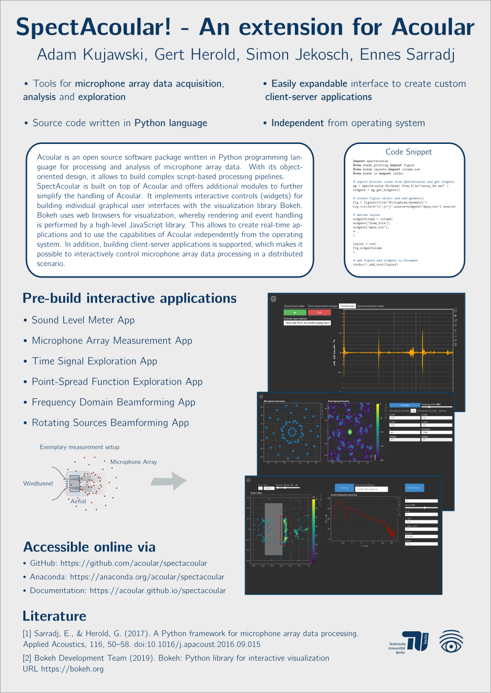

|python-version|

.. Badges:
.. |python-version| image:: https://img.shields.io/badge/python-3.7%20%7C%203.8-blue
    :target: https://www.python.org/

================
SpectAcoular
================

:Documentation: https://acoular.github.io/spectacoular/

Quick Start
=============

**SpectAcoular** is available on conda. In the command line, type

.. code-block:: console

    $ conda install -c acoular spectacoular

This will install SpectAcoular in your Anaconda Python environment and make the SpectAcoular library available from Python. In addition, this will install all dependencies (those other packages mentioned above) if they are not already present on your system.

To verify your installation, one can run one of the pre-build interactive applications (e.g. MicGeomExample app). To do so, navigate to the `spectacoular/apps` folder and type the following command in a dedicated console (e.g. shell)

.. code-block:: console

    $ bokeh serve --show MicGeomExample

A new window should appear in the browser running the application.
